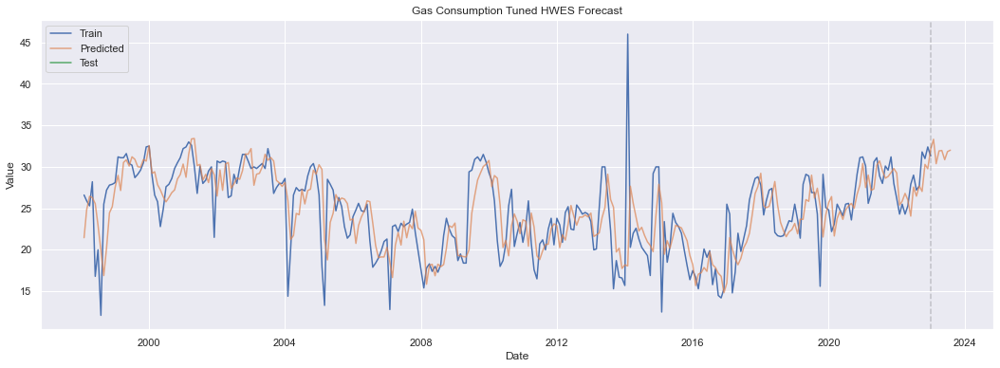
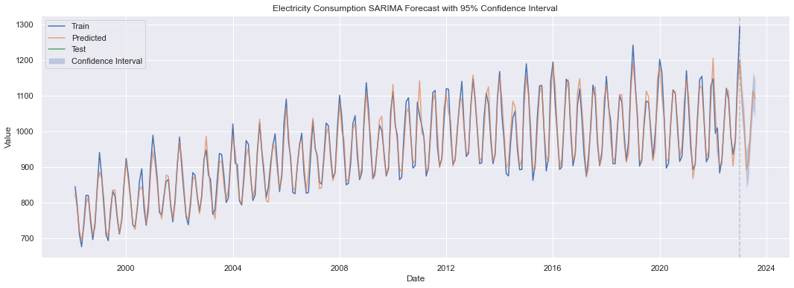
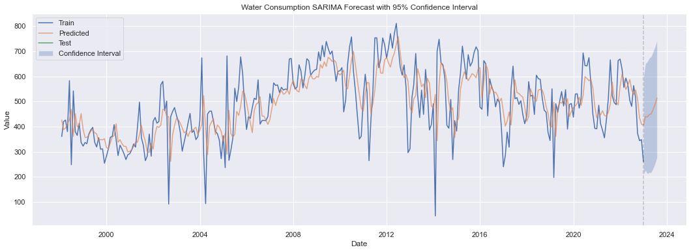
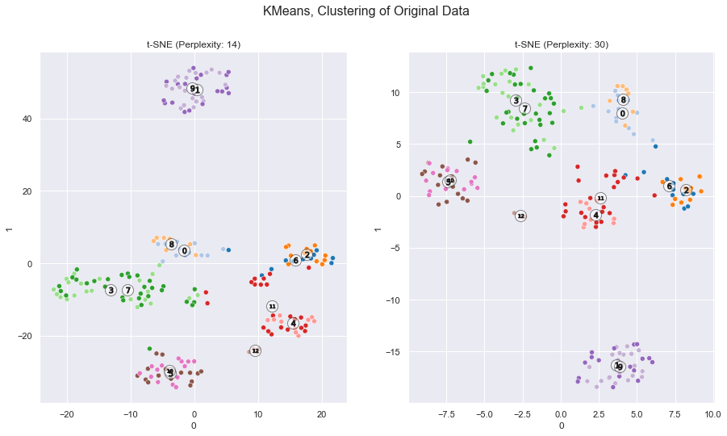
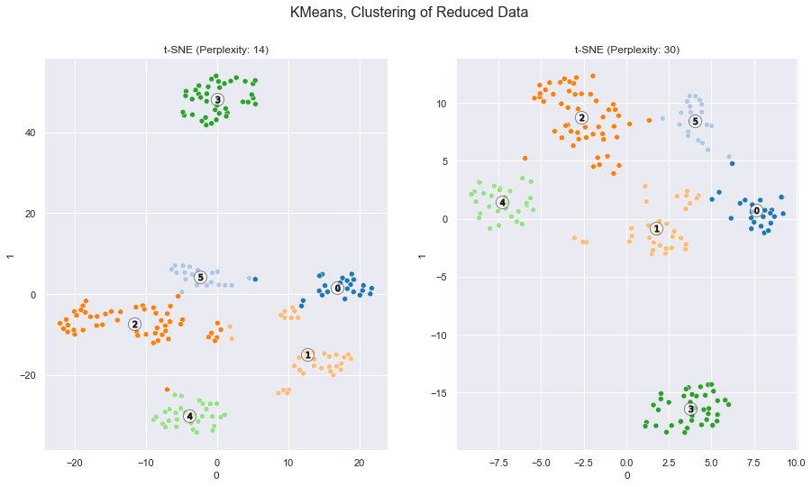

# Machine Learning Project: Clustering and Time Series Analysis

Welcome to the GitHub repository for one of my machine learning projects, which was one of my submission for AI and ML module at Singapore Polytechnic, where I've explored two fascinating aspects of data analysis: **Clustering** and **Time Series Analysis**. In this project, I've leveraged advanced techniques to gain insights from data and make informed decisions. Both datasets were provided as part of the assignment and I have linked the original source for the dataset where possible.

## Time Series Analysis

### Dataset: Energy Consumption

In the Time Series Analysis section, I've worked with a dataset containing information on energy consumption. This dataset includes the following columns:

- **Gas Consumption (tons)**: Gas consumption in tons.
- **Electricity Consumption (MWh)**: Electricity consumption in MWh.
- **Water Consumption (tons)**: Water consumption in tons.

#### Key Highlights

- **Model Selection**: I've employed models from the `statsmodels` library, including those from the ARIMA family, as well as Exponential Smoothing models. These models are used to forecast future fluctuations in the energy consumption features.

- **Hyperparameter Optimization**: Just as in the previous project, I've integrated the Artificial Bee Colony (ABC) algorithm to optimize hyperparameters, ensuring the accuracy of the time series forecasts.

- **Stationarity Tests**: To ensure the reliability of the time series models, I've conducted statistical tests such as the Augmented Dickey-Fuller (ADF) test and Kwiatkowski-Phillips-Schmidt-Shin (KPSS) test to check for stationarity in the data.






## Clustering

### Dataset: Customer Segmentation [From Udemy's Machine Learning A-Z course](https://github.com/SteffiPeTaffy/machineLearningAZ/blob/master/Machine%20Learning%20A-Z%20Template%20Folder/Part%204%20-%20Clustering/Section%2025%20-%20Hierarchical%20Clustering/Mall_Customers.csv)

In the Clustering section, I've aimed to group mall customers based on various factors, including:

- **Customer ID**: A unique ID assigned to each customer.
- **Gender**: Gender of the customer.
- **Age**: Age of the customer.
- **Income (k$)**: Annual income of the customer in thousands of dollars.
- **How Much They Spend**: A score assigned by the mall based on customer behavior and spending nature.

#### Goal

The primary objective is to identify distinct customer segments within the mall's customer base, enabling the mall to tailor its marketing strategies and prioritize customer groups effectively.

#### Key Techniques

- **t-SNE Dimensionality Reduction**: I've employed t-Distributed Stochastic Neighbor Embedding (t-SNE) to cast higher-dimensional customer data into lower dimensions, making it easier to visualize and analyze the relationships between customers and their spending behavior.




## Getting Started

To get started with this project, clone the repository to your local machine:

   ```bash
   git clone https://github.com/glennwuwu/aiml-clustering-and-time-series-analysis.git
   ```

## License

This project is licensed under the MIT License - see the [LICENSE](LICENSE) file for details.

## Contact

If you have any questions or suggestions regarding this project, feel free to reach out to me. You can find my contact information in my GitHub profile.

Thank you for exploring this exciting data analysis project! I hope you find it insightful and informative. Happy data exploration! 📊📈🧮
